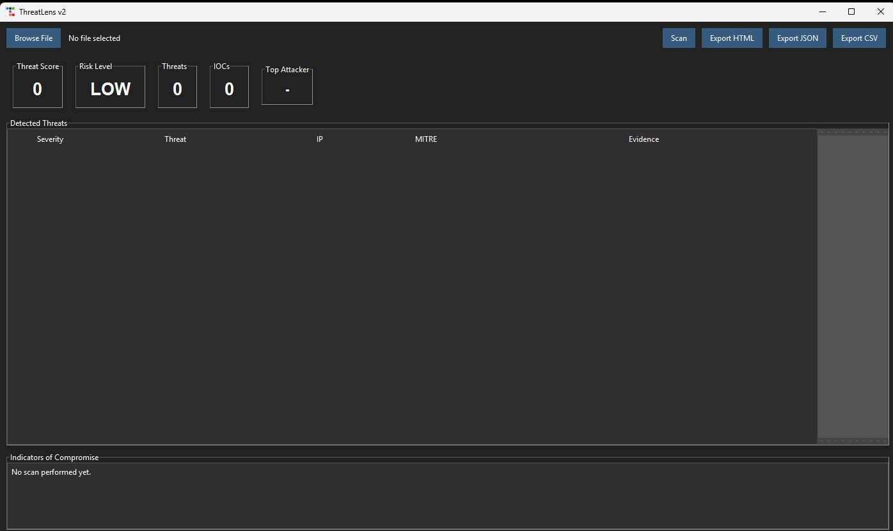
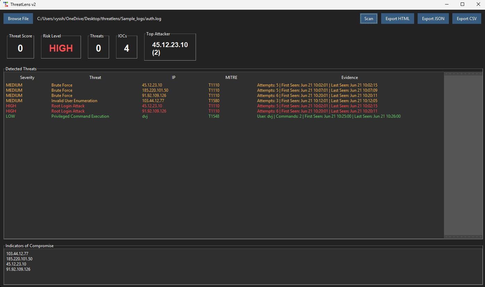
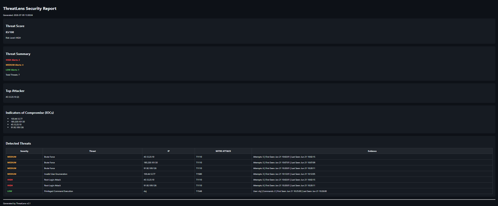
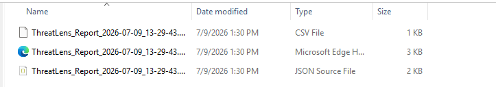

## ThreatLens-v2

A Python project for analyzing authentication and web server logs through a graphical interface to detect common security threats.

## About

I built ThreatLens v2 after completing ThreatLens v1 because I wanted to make the project more practical and easier to use.

The first version focused on understanding log analysis and rule-based detection. In this version, I added a graphical interface, threat scoring, IOC extraction, report generation, and support for additional detections.

The goal wasn't to build a full SIEM. I wanted to understand how multiple detections can be presented together in a dashboard and how security reports can be generated from log data.

## Why I Built It

After finishing ThreatLens v1, I wanted to continue improving the project instead of starting something completely new.

This version helped me learn more about building desktop applications with Python, organizing larger projects into multiple modules, improving detection logic, and presenting security findings in a more useful way.

I also wanted to make the project feel closer to the type of tools used in SOC environments while still keeping it simple enough to understand and maintain.

## Features

• Detects brute-force attacks 
• Detects invalid user enumeration 
• Detects failed root login attempts 
• Detects suspicious sudo activity 
• Detects SQL injection attempts 
• Detects XSS attempts 
• Detects Nmap scans 
• Detects Hydra brute-force activity 
• Detects reverse shell activity 
• Extracts IOCs 
• Calculates a threat score 
• Maps detections to the MITRE ATT&CK framework 
• Displays results through a graphical dashboard 
• Shows the top attacking IP address 
• Generates HTML, JSON, and CSV reports 

## Screenshots

### Dashboard

Application before running a scan.

### Detection Results

Results after scanning a sample authentication log.

### HTML Report

Threat summary, IOC extraction, MITRE mapping, and detected threats.

### Generated Reports

ThreatLens can export reports in HTML, JSON, and CSV formats.

## How it works
Select Log File
        ↓
Parse Log Entries
        ↓
Apply Detection Rules
        ↓
Generate Alerts
        ↓
Calculate Threat Score
        ↓
Extract IOCs
        ↓
Display Results
        ↓
Export Reports

## Current Limitations

This is still a rule-based project.

It currently works with supported authentication and web server log formats.

Some detections rely on keyword matching, so the tool is intended for learning and demonstration rather than production use.

## Future Improvements
• Additional detection rules 
• Better filtering and searching 
• Charts for threat statistics 
• AI-generated incident summaries using a local language model 
• Support for more log formats 
      

